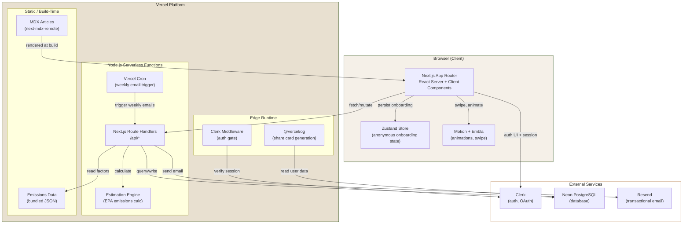
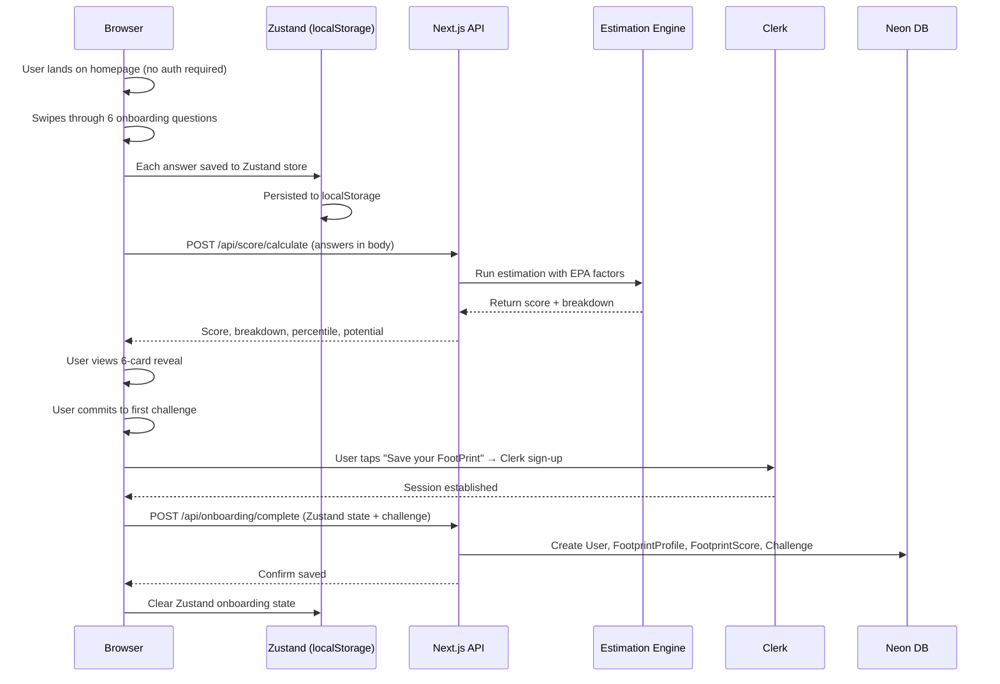

# My FootPrint — Software Architecture Plan

**Version:** 1.0
**Date:** March 1, 2026
**Status:** Prototype
**Deployment:** Vercel

---

## Table of Contents

1. [System Overview](#system-overview)
2. [Technology Stack](#technology-stack)
3. [Data Model](#data-model)
4. [API Design](#api-design)
5. [Project Structure](#project-structure)

---

## System Overview

### High-Level Architecture



### Component Relationships

| Component | Role | Communicates With |
|---|---|---|
| **Next.js App Router** | Serves pages (RSC + client), handles routing | All components |
| **Clerk** | Authentication, session management, OAuth flows | Middleware, client UI, API routes |
| **Zustand Store** | Holds onboarding answers before account creation | Client components, persisted to localStorage |
| **Route Handlers** | API endpoints for all CRUD operations | Neon (via Drizzle), Estimation Engine, Resend |
| **Estimation Engine** | Calculates footprint from profile inputs + EPA data | Route handlers, bundled emissions JSON |
| **Neon PostgreSQL** | Persistent data storage (users, scores, challenges) | Route handlers, OG image generator |
| **Resend** | Sends weekly check-in and re-engagement emails | Triggered by Vercel Cron via route handler |
| **@vercel/og** | Generates shareable FootPrint Card images | Reads user data from Neon |
| **MDX Articles** | Knowledge articles rendered at build time | Served as static pages |
| **Motion + Embla** | Client-side animations and swipe carousel | React client components only |
| **Recharts** | Pie/donut/line charts for breakdown and trends | React client components only |

### Request Flow: First-Time User (Anonymous → Authenticated)



---

## Technology Stack

### Core Framework

| Package | Version | Purpose | Rationale |
|---|---|---|---|
| `next` | 15.x | App Router, RSC, API routes, static generation | Vercel-native, SSR + static hybrid, best deployment integration |
| `react` | 19.x | UI rendering | Required by Next.js 15 |
| `typescript` | 5.x | Type safety | Non-negotiable for maintainability |

### Styling

| Package | Version | Purpose | Rationale |
|---|---|---|---|
| `tailwindcss` | 4.x | Utility-first CSS framework | v4's `@theme` directive maps design tokens directly to CSS variables — eliminates separate token management. Native CSS variable output. |
| `@tailwindcss/typography` | 1.x | Prose styling for MDX articles | Clean typography for knowledge articles without custom CSS |
| `clsx` | 2.x | Conditional class merging | Lightweight (228B), cleaner than template literals |
| `tailwind-merge` | 2.x | Tailwind class conflict resolution | Prevents `bg-red bg-blue` conflicts in component composition |

### Database & ORM

| Package | Version | Purpose | Rationale |
|---|---|---|---|
| `drizzle-orm` | 0.3x | Type-safe ORM | 7KB bundle, zero codegen, SQL-like API, first-class Neon support |
| `drizzle-kit` | 0.3x | Schema migrations | CLI for `drizzle-kit generate` and `drizzle-kit migrate` |
| `@neondatabase/serverless` | 0.10.x | Neon serverless driver | WebSocket-based Postgres driver optimized for serverless cold starts |

### Authentication

| Package | Version | Purpose | Rationale |
|---|---|---|---|
| `@clerk/nextjs` | 6.x | Auth provider, middleware, hooks, UI components | Best Next.js App Router integration, pre-built sign-in/up flows, Google + Apple OAuth |

### Animations & Interactions

| Package | Version | Purpose | Rationale |
|---|---|---|---|
| `motion` | 12.x | Animations, gestures, spring physics | LazyMotion keeps initial bundle to ~4.6KB. Spring physics for micro-interactions, drag for swipe support, AnimatePresence for transitions |
| `embla-carousel-react` | 8.x | Swipeable card carousel | 7KB, headless/unstyled, SSR-safe, touch physics with snap points. Powers the onboarding questionnaire and Wrapped-style reveal |

### Charts

| Package | Version | Purpose | Rationale |
|---|---|---|---|
| `recharts` | 2.x | Pie/donut charts (breakdown), line charts (trends) | Declarative React components, built-in animations, ~45KB. Lazy-loaded on routes that need it |

### State Management

| Package | Version | Purpose | Rationale |
|---|---|---|---|
| `zustand` | 5.x | Client-side state (onboarding flow, UI state) | 1KB, no Provider needed, `persist` middleware for localStorage. Holds anonymous onboarding answers until account creation |

### Content

| Package | Version | Purpose | Rationale |
|---|---|---|---|
| `next-mdx-remote` | 5.x | Render MDX articles from file system | Server-compatible MDX rendering, supports custom components, no bundler plugin needed |
| `gray-matter` | 4.x | Parse MDX frontmatter | Extract title, category, readTime from article files |

### Email

| Package | Version | Purpose | Rationale |
|---|---|---|---|
| `resend` | 4.x | Transactional email API | Vercel-native, 3K free emails/month |
| `@react-email/components` | 1.x | Email templates as React components | Write email templates in JSX, not table-based HTML |

### Image Generation

| Package | Version | Purpose | Rationale |
|---|---|---|---|
| `@vercel/og` | 0.6.x | Share card PNG generation | Runs on Edge, JSX → PNG in milliseconds, purpose-built for Vercel. Used for FootPrint Cards |

### Utilities

| Package | Version | Purpose | Rationale |
|---|---|---|---|
| `zod` | 3.x | Schema validation for API inputs/outputs | Type-safe validation, pairs with Drizzle for form → DB pipeline |
| `nanoid` | 5.x | Generate short IDs for share URLs | Smaller and faster than UUID for user-facing IDs |
| `date-fns` | 4.x | Date formatting and manipulation | Tree-shakable, immutable, for weekly check-in date logic |

### Dev Dependencies

| Package | Purpose |
|---|---|
| `eslint` + `eslint-config-next` | Linting |
| `prettier` + `prettier-plugin-tailwindcss` | Formatting with Tailwind class sorting |
| `drizzle-kit` | Database migrations |

---

## Data Model

### Entity Relationship Diagram

```mermaid
erDiagram
    USER ||--o| FOOTPRINT_PROFILE : has
    USER ||--o{ FOOTPRINT_SCORE : tracks
    USER ||--o{ CHALLENGE : commits_to
    USER ||--o{ CHECK_IN : submits
    USER ||--o{ PUBLIC_CHALLENGE_PARTICIPANT : joins
    PUBLIC_CHALLENGE ||--o{ PUBLIC_CHALLENGE_PARTICIPANT : has
    PARTNER }o--|| CATEGORY : belongs_to

    USER {
        text id PK "nanoid"
        text email UK "from Clerk"
        text clerk_id UK "Clerk user ID"
        text display_name "nullable"
        text zip_code "nullable"
        text region "fallback for zip"
        boolean onboarding_complete "default false"
        text notification_day "default monday"
        text character_type "tree | creature | planet"
        timestamp created_at
        timestamp last_check_in "nullable"
    }

    FOOTPRINT_PROFILE {
        text id PK
        text user_id FK
        text diet_type "meat_heavy | flexitarian | vegetarian | vegan"
        text transit_mode "car | transit | bike | walk | mix"
        text home_type "apartment | small_house | large_house"
        text shopping_frequency "frequent | moderate | minimal"
        text flights_per_year "none | one_to_two | three_plus"
        jsonb custom_overrides "manual refinements"
        timestamp updated_at
    }

    FOOTPRINT_SCORE {
        text id PK
        text user_id FK
        decimal total_tons "annual CO2e"
        decimal earth_equivalents
        integer percentile_rank "0-100"
        jsonb breakdown "per-category tons"
        text source "initial | check_in | refinement"
        timestamp calculated_at
    }

    CHALLENGE {
        text id PK
        text user_id FK
        text category "food | transit | home | shopping | travel | work"
        text title
        text description
        decimal impact_tons "projected annual savings"
        text status "active | completed | abandoned"
        timestamp started_at
        timestamp completed_at "nullable"
    }

    CHECK_IN {
        text id PK
        text user_id FK
        date week_of "Monday of check-in week"
        jsonb challenge_progress "challenge_id: thumbs_up | thumbs_down"
        jsonb additional_notes "optional extra changes"
        timestamp created_at
    }

    PUBLIC_CHALLENGE {
        text id PK
        text title
        text description
        text category
        date start_date
        date end_date
        integer participant_count "denormalized"
    }

    PUBLIC_CHALLENGE_PARTICIPANT {
        text id PK
        text public_challenge_id FK
        text user_id FK
        text status "active | completed | left"
        timestamp joined_at
    }

    PARTNER {
        text id PK
        text name
        text category
        text description
        text impact_claim
        text url "referral link"
        text vetting_status "approved | pending | rejected"
        text transparency_note
    }

    CATEGORY {
        text name PK "food | transit | home | shopping | travel | work"
    }
```



### Drizzle Schema Definitions

```typescript
// src/db/schema.ts

import { pgTable, text, timestamp, boolean, decimal, integer, date, jsonb } from 'drizzle-orm/pg-core';
import { relations } from 'drizzle-orm';

// ── Users ──────────────────────────────────────────────

export const users = pgTable('users', {
  id: text('id').primaryKey(),                    // nanoid
  clerkId: text('clerk_id').unique().notNull(),   // from Clerk webhook
  email: text('email').unique().notNull(),
  displayName: text('display_name'),
  zipCode: text('zip_code'),
  region: text('region'),
  onboardingComplete: boolean('onboarding_complete').default(false).notNull(),
  notificationDay: text('notification_day').default('monday').notNull(),
  characterType: text('character_type'),          // tree | creature | planet
  createdAt: timestamp('created_at').defaultNow().notNull(),
  lastCheckIn: timestamp('last_check_in'),
});

// ── Footprint Profile ──────────────────────────────────

export const footprintProfiles = pgTable('footprint_profiles', {
  id: text('id').primaryKey(),
  userId: text('user_id').references(() => users.id, { onDelete: 'cascade' }).unique().notNull(),
  dietType: text('diet_type').notNull(),          // meat_heavy | flexitarian | vegetarian | vegan
  transitMode: text('transit_mode').notNull(),    // car | transit | bike | walk | mix
  homeType: text('home_type').notNull(),          // apartment | small_house | large_house
  shoppingFrequency: text('shopping_frequency').notNull(), // frequent | moderate | minimal
  flightsPerYear: text('flights_per_year').notNull(),      // none | one_to_two | three_plus
  customOverrides: jsonb('custom_overrides').$type<Record<string, number>>(),
  updatedAt: timestamp('updated_at').defaultNow().notNull(),
});

// ── Footprint Scores (history) ─────────────────────────

export const footprintScores = pgTable('footprint_scores', {
  id: text('id').primaryKey(),
  userId: text('user_id').references(() => users.id, { onDelete: 'cascade' }).notNull(),
  totalTons: decimal('total_tons', { precision: 6, scale: 2 }).notNull(),
  earthEquivalents: decimal('earth_equivalents', { precision: 4, scale: 2 }).notNull(),
  percentileRank: integer('percentile_rank').notNull(),
  breakdown: jsonb('breakdown').$type<{
    food: number;
    transit: number;
    home: number;
    shopping: number;
    travel: number;
    work: number;
  }>().notNull(),
  source: text('source').notNull(),               // initial | check_in | refinement
  calculatedAt: timestamp('calculated_at').defaultNow().notNull(),
});

// ── Challenges ─────────────────────────────────────────

export const challenges = pgTable('challenges', {
  id: text('id').primaryKey(),
  userId: text('user_id').references(() => users.id, { onDelete: 'cascade' }).notNull(),
  category: text('category').notNull(),
  title: text('title').notNull(),
  description: text('description').notNull(),
  impactTons: decimal('impact_tons', { precision: 5, scale: 3 }).notNull(),
  status: text('status').default('active').notNull(), // active | completed | abandoned
  startedAt: timestamp('started_at').defaultNow().notNull(),
  completedAt: timestamp('completed_at'),
});

// ── Check-Ins ──────────────────────────────────────────

export const checkIns = pgTable('check_ins', {
  id: text('id').primaryKey(),
  userId: text('user_id').references(() => users.id, { onDelete: 'cascade' }).notNull(),
  weekOf: date('week_of').notNull(),
  challengeProgress: jsonb('challenge_progress').$type<Record<string, 'thumbs_up' | 'thumbs_down'>>(),
  additionalNotes: jsonb('additional_notes').$type<Record<string, string>>(),
  createdAt: timestamp('created_at').defaultNow().notNull(),
});

// ── Public Challenges ──────────────────────────────────

export const publicChallenges = pgTable('public_challenges', {
  id: text('id').primaryKey(),
  title: text('title').notNull(),
  description: text('description').notNull(),
  category: text('category').notNull(),
  startDate: date('start_date').notNull(),
  endDate: date('end_date').notNull(),
  participantCount: integer('participant_count').default(0).notNull(),
});

export const publicChallengeParticipants = pgTable('public_challenge_participants', {
  id: text('id').primaryKey(),
  publicChallengeId: text('public_challenge_id').references(() => publicChallenges.id, { onDelete: 'cascade' }).notNull(),
  userId: text('user_id').references(() => users.id, { onDelete: 'cascade' }).notNull(),
  status: text('status').default('active').notNull(), // active | completed | left
  joinedAt: timestamp('joined_at').defaultNow().notNull(),
});

// ── Partners ───────────────────────────────────────────

export const partners = pgTable('partners', {
  id: text('id').primaryKey(),
  name: text('name').notNull(),
  category: text('category').notNull(),
  description: text('description').notNull(),
  impactClaim: text('impact_claim').notNull(),
  url: text('url').notNull(),
  vettingStatus: text('vetting_status').default('pending').notNull(),
  transparencyNote: text('transparency_note').notNull(),
});

// ── Relations ──────────────────────────────────────────

export const usersRelations = relations(users, ({ one, many }) => ({
  profile: one(footprintProfiles),
  scores: many(footprintScores),
  challenges: many(challenges),
  checkIns: many(checkIns),
  publicChallengeParticipants: many(publicChallengeParticipants),
}));

export const footprintProfilesRelations = relations(footprintProfiles, ({ one }) => ({
  user: one(users, { fields: [footprintProfiles.userId], references: [users.id] }),
}));

export const footprintScoresRelations = relations(footprintScores, ({ one }) => ({
  user: one(users, { fields: [footprintScores.userId], references: [users.id] }),
}));

export const challengesRelations = relations(challenges, ({ one }) => ({
  user: one(users, { fields: [challenges.userId], references: [users.id] }),
}));

export const checkInsRelations = relations(checkIns, ({ one }) => ({
  user: one(users, { fields: [checkIns.userId], references: [users.id] }),
}));

export const publicChallengeParticipantsRelations = relations(publicChallengeParticipants, ({ one }) => ({
  publicChallenge: one(publicChallenges, { fields: [publicChallengeParticipants.publicChallengeId], references: [publicChallenges.id] }),
  user: one(users, { fields: [publicChallengeParticipants.userId], references: [users.id] }),
}));
```

### Emissions Data (Static JSON)

EPA emissions factors and regional data are **not** stored in the database. They are bundled as static JSON files in `src/data/emissions/`:

```
src/data/emissions/
├── factors.json          # Per-category base emissions (tons CO2e/year)
├── grid-regions.json     # Zip code → eGRID region mapping
├── grid-intensity.json   # eGRID region → lbs CO2/MWh
├── benchmarks.json       # Percentile distributions by region
└── swaps.json            # Available "What if?" alternatives with impact deltas
```

This data is read server-side by the estimation engine. It changes infrequently (annually) and does not need a database.

---

## API Design

All API routes use Next.js App Router route handlers (`app/api/.../route.ts`). Authenticated routes are protected by Clerk middleware. Request/response bodies are validated with Zod.

### Public Routes (No Auth Required)

#### `POST /api/score/calculate`

Calculate a footprint score from onboarding answers. Used before account creation.

```typescript
// Request
{
  zipCode?: string,
  dietType: "meat_heavy" | "flexitarian" | "vegetarian" | "vegan",
  transitMode: "car" | "transit" | "bike" | "walk" | "mix",
  homeType: "apartment" | "small_house" | "large_house",
  shoppingFrequency: "frequent" | "moderate" | "minimal",
  flightsPerYear: "none" | "one_to_two" | "three_plus"
}

// Response 200
{
  totalTons: 14.2,
  earthEquivalents: 1.7,
  percentileRank: 55,
  breakdown: {
    food: 4.2,
    transit: 3.8,
    home: 3.1,
    shopping: 1.8,
    travel: 1.3
  },
  topSwap: {
    category: "food",
    title: "Try Meatless Monday",
    description: "Skip meat one day per week",
    impactTons: 0.4
  }
}
```

#### `GET /api/articles`

List knowledge articles. Reads from MDX file metadata.

```typescript
// Query params: ?category=food
// Response 200
{
  articles: [
    {
      slug: "hidden-carbon-cost-of-fast-fashion",
      title: "The Hidden Carbon Cost of Fast Fashion",
      category: "shopping",
      readTimeMinutes: 3,
      takeaways: ["Buy 30% less new clothing", "Try secondhand first"]
    }
  ]
}
```

#### `GET /api/articles/[slug]`

Get a single article. Returns rendered MDX content.

```typescript
// Response 200
{
  slug: "hidden-carbon-cost-of-fast-fashion",
  title: "The Hidden Carbon Cost of Fast Fashion",
  category: "shopping",
  readTimeMinutes: 3,
  body: "<rendered HTML>",
  takeaways: ["..."],
  sources: [{ title: "EPA Report 2024", url: "https://..." }]
}
```

#### `GET /api/public-challenges`

List active public challenges. No auth needed to browse.

```typescript
// Response 200
{
  challenges: [
    {
      id: "abc123",
      title: "March Meatless Challenge",
      description: "Go meatless for the month of March",
      category: "food",
      startDate: "2026-03-01",
      endDate: "2026-03-31",
      participantCount: 247
    }
  ]
}
```

### Authenticated Routes (Clerk Session Required)

#### `POST /api/onboarding/complete`

Persist onboarding data after account creation. Called once, after Clerk sign-up, with the Zustand store contents.

```typescript
// Request
{
  zipCode?: string,
  region?: string,
  profile: {
    dietType: "flexitarian",
    transitMode: "car",
    homeType: "apartment",
    shoppingFrequency: "moderate",
    flightsPerYear: "one_to_two"
  },
  score: {
    totalTons: 14.2,
    earthEquivalents: 1.7,
    percentileRank: 55,
    breakdown: { food: 4.2, transit: 3.8, home: 3.1, shopping: 1.8, travel: 1.3 }
  },
  characterType: "tree",
  firstChallenge?: {
    category: "food",
    title: "Try Meatless Monday",
    description: "Skip meat one day per week",
    impactTons: 0.4
  }
}

// Response 201
{ userId: "usr_abc123", onboardingComplete: true }
```

#### `GET /api/profile`

Get the authenticated user's footprint profile.

```typescript
// Response 200
{
  user: { id, email, displayName, zipCode, region, characterType, notificationDay },
  profile: { dietType, transitMode, homeType, shoppingFrequency, flightsPerYear, customOverrides }
}
```

#### `PUT /api/profile`

Update profile inputs (manual refinement). Triggers score recalculation.

```typescript
// Request (partial update)
{
  dietType?: "vegetarian",
  customOverrides?: { "food.meat": 2.1 }
}

// Response 200
{
  profile: { ...updated },
  newScore: { totalTons: 12.8, ... }
}
```

#### `GET /api/score/history`

Get score history for trend display.

```typescript
// Query params: ?limit=12
// Response 200
{
  scores: [
    { totalTons: 14.2, breakdown: {...}, source: "initial", calculatedAt: "2026-03-01T..." },
    { totalTons: 13.8, breakdown: {...}, source: "check_in", calculatedAt: "2026-03-08T..." }
  ],
  cumulativeSaved: 0.4,
  projectedAnnual: 13.2
}
```

#### `GET /api/challenges`

List user's personal challenges.

```typescript
// Query params: ?status=active
// Response 200
{
  challenges: [
    {
      id: "ch_abc",
      category: "food",
      title: "Try Meatless Monday",
      impactTons: 0.4,
      status: "active",
      startedAt: "2026-03-01T...",
      weeklyProgress: [
        { weekOf: "2026-03-03", result: "thumbs_up" },
        { weekOf: "2026-03-10", result: null }
      ]
    }
  ]
}
```

#### `POST /api/challenges`

Commit to a new challenge (from a "What if?" swap).

```typescript
// Request
{
  category: "transit",
  title: "Bike to work 2 days/week",
  description: "Replace car commute with cycling twice per week",
  impactTons: 0.8
}

// Response 201
{ id: "ch_xyz", status: "active", startedAt: "2026-03-15T..." }
```

#### `PUT /api/challenges/[id]`

Update challenge status.

```typescript
// Request
{ status: "completed" }

// Response 200
{ id: "ch_abc", status: "completed", completedAt: "2026-04-01T..." }
```

#### `POST /api/check-ins`

Submit a weekly check-in. Triggers score recalculation.

```typescript
// Request
{
  challengeProgress: {
    "ch_abc": "thumbs_up",
    "ch_xyz": "thumbs_down"
  },
  additionalNotes: {
    "transit": "Biked 3 times this week instead of 2"
  }
}

// Response 201
{
  checkIn: { id: "ci_abc", weekOf: "2026-03-10", createdAt: "..." },
  updatedScore: { totalTons: 13.8, ... },
  milestone: { type: "first_check_in", message: "Your first check-in! Your character is growing." } | null
}
```

#### `POST /api/public-challenges/[id]/join`

Join a public challenge.

```typescript
// Response 201
{ participantId: "pcp_abc", status: "active" }
```

#### `POST /api/public-challenges/[id]/leave`

Leave a public challenge.

```typescript
// Response 200
{ status: "left" }
```

#### `GET /api/benchmarks/[zip]`

Get peer benchmarks for a zip code.

```typescript
// Response 200
{
  zip: "94103",
  region: "California",
  averageTons: 16.1,
  percentiles: { p25: 10.2, p50: 14.8, p75: 19.4, p90: 24.1 },
  sampleSize: 1250
}
```

#### `POST /api/share/card`

Generate a shareable FootPrint Card image. Returns a URL to the generated image.

```typescript
// Request
{
  type: "reveal" | "milestone" | "challenge_complete",
  includeScore: boolean,
  data: { totalTons?: 14.2, milestone?: "first_ton_saved", challengeTitle?: "..." }
}

// Response 200
{ imageUrl: "https://myfootprint.app/api/og/card_abc123.png" }
```

#### `GET /api/og/[cardId]`

Edge function that generates the share card image using `@vercel/og`. Returns `image/png`.

### Cron Route

#### `POST /api/cron/weekly-emails`

Triggered by Vercel Cron every day. Sends check-in reminders to users whose `notificationDay` matches today.

```typescript
// Vercel Cron config (vercel.json)
{
  "crons": [
    { "path": "/api/cron/weekly-emails", "schedule": "0 9 * * *" }
  ]
}

// Protected by CRON_SECRET header verification
// Response 200
{ sent: 42, skipped: 3, errors: 0 }
```

#### `GET /api/swaps`

Get available "What if?" swaps for a category, personalized to the user's profile.

```typescript
// Query params: ?category=food
// Response 200
{
  swaps: [
    {
      id: "swap_meatless_monday",
      category: "food",
      title: "Try Meatless Monday",
      description: "Skip meat one day per week",
      impactTons: 0.4,
      difficulty: "easy",
      partner: null | { name: "GreenPlate", transparencyNote: "Paid partnership", url: "..." }
    },
    {
      id: "swap_go_vegetarian",
      category: "food",
      title: "Go fully vegetarian",
      description: "Eliminate meat from your diet",
      impactTons: 1.6,
      difficulty: "hard",
      partner: null
    }
  ]
}
```

---

## Project Structure

```
myfootprint/
├── docs/
│   └── product/
│       ├── PRD.md                          # Product requirements
│       ├── DESIGN_SYSTEM.md                # Design tokens + aesthetics prompt
│       └── ARCHITECTURE.md                 # This document
│
├── public/
│   ├── fonts/
│   │   ├── ClashDisplay-Variable.woff2     # Display headlines
│   │   ├── JetBrainsMono-Variable.woff2    # Data/numbers
│   │   └── SpaceGrotesk-Variable.woff2     # Body text
│   ├── illustrations/
│   │   ├── food-watercolor.svg             # Category background illustrations
│   │   ├── transit-watercolor.svg
│   │   ├── home-watercolor.svg
│   │   ├── shopping-watercolor.svg
│   │   ├── travel-watercolor.svg
│   │   └── work-watercolor.svg
│   └── favicon.ico
│
├── content/
│   └── articles/                           # MDX knowledge articles
│       ├── hidden-carbon-cost-of-fast-fashion.mdx
│       ├── your-bank-and-fossil-fuels.mdx
│       ├── meat-and-climate.mdx
│       ├── the-flight-dilemma.mdx
│       └── home-energy-quick-wins.mdx
│
├── src/
│   ├── app/                                # Next.js App Router
│   │   ├── layout.tsx                      # Root layout: fonts, Clerk provider, Tailwind
│   │   ├── page.tsx                        # Landing page (public)
│   │   ├── globals.css                     # Tailwind v4 @theme tokens, base styles
│   │   │
│   │   ├── onboarding/
│   │   │   ├── page.tsx                    # Swipeable questionnaire (public, no auth)
│   │   │   └── reveal/
│   │   │       └── page.tsx                # Wrapped-style 6-card reveal (public)
│   │   │
│   │   ├── (authenticated)/                # Route group: Clerk auth required
│   │   │   ├── layout.tsx                  # Auth check + bottom nav
│   │   │   ├── dashboard/
│   │   │   │   └── page.tsx                # Home: score hero, challenges, breakdown
│   │   │   ├── explore/
│   │   │   │   ├── page.tsx                # Category breakdown overview
│   │   │   │   └── [category]/
│   │   │   │       └── page.tsx            # Category detail + "What if?" swaps
│   │   │   ├── challenges/
│   │   │   │   └── page.tsx                # Active + public challenges
│   │   │   ├── check-in/
│   │   │   │   └── page.tsx                # Weekly check-in flow
│   │   │   ├── learn/
│   │   │   │   ├── page.tsx                # Article list with category filters
│   │   │   │   └── [slug]/
│   │   │   │       └── page.tsx            # Single article (rendered MDX)
│   │   │   ├── trends/
│   │   │   │   └── page.tsx                # Score history + trend charts
│   │   │   └── profile/
│   │   │       └── page.tsx                # User settings, notification prefs, account
│   │   │
│   │   ├── sign-in/[[...sign-in]]/
│   │   │   └── page.tsx                    # Clerk sign-in page
│   │   ├── sign-up/[[...sign-up]]/
│   │   │   └── page.tsx                    # Clerk sign-up page
│   │   │
│   │   └── api/
│   │       ├── score/
│   │       │   ├── calculate/route.ts      # POST: estimate from inputs (public)
│   │       │   └── history/route.ts        # GET: score trend (auth)
│   │       ├── onboarding/
│   │       │   └── complete/route.ts       # POST: persist onboarding data (auth)
│   │       ├── profile/route.ts            # GET/PUT: user profile (auth)
│   │       ├── challenges/
│   │       │   ├── route.ts                # GET/POST: list/create challenges (auth)
│   │       │   └── [id]/route.ts           # PUT: update challenge (auth)
│   │       ├── check-ins/route.ts          # GET/POST: list/submit check-ins (auth)
│   │       ├── public-challenges/
│   │       │   ├── route.ts                # GET: list public challenges (public)
│   │       │   └── [id]/
│   │       │       ├── join/route.ts       # POST: join (auth)
│   │       │       └── leave/route.ts      # POST: leave (auth)
│   │       ├── articles/
│   │       │   ├── route.ts                # GET: list articles (public)
│   │       │   └── [slug]/route.ts         # GET: single article (public)
│   │       ├── swaps/route.ts              # GET: available swaps by category (auth)
│   │       ├── benchmarks/
│   │       │   └── [zip]/route.ts          # GET: peer benchmarks (public)
│   │       ├── share/
│   │       │   └── card/route.ts           # POST: generate share card (auth)
│   │       ├── og/
│   │       │   └── [cardId]/route.ts       # GET: render share card image (edge)
│   │       ├── webhooks/
│   │       │   └── clerk/route.ts          # POST: Clerk webhook (user created/deleted)
│   │       └── cron/
│   │           └── weekly-emails/route.ts  # POST: send weekly reminders (cron)
│   │
│   ├── components/
│   │   ├── ui/                             # Base UI primitives
│   │   │   ├── button.tsx
│   │   │   ├── card.tsx
│   │   │   ├── toggle.tsx
│   │   │   ├── progress-bar.tsx
│   │   │   ├── tooltip.tsx
│   │   │   └── skeleton.tsx
│   │   ├── onboarding/
│   │   │   ├── question-carousel.tsx       # Embla carousel for 6 questions
│   │   │   ├── question-card.tsx           # Single question with icon selectors
│   │   │   ├── footprint-preview.tsx       # Live-updating footprint visual
│   │   │   └── progress-dots.tsx           # Dot indicators
│   │   ├── reveal/
│   │   │   ├── reveal-carousel.tsx         # Full-screen Embla carousel
│   │   │   ├── score-card.tsx              # Card 1: headline score
│   │   │   ├── world-card.tsx              # Card 2: Earth equivalents
│   │   │   ├── breakdown-card.tsx          # Card 3: animated pie chart
│   │   │   ├── rank-card.tsx               # Card 4: peer comparison
│   │   │   ├── potential-card.tsx          # Card 5: savings potential
│   │   │   ├── character-card.tsx          # Card 6: avatar reveal
│   │   │   └── count-up.tsx               # Animated number count-up (Motion)
│   │   ├── dashboard/
│   │   │   ├── score-hero.tsx              # Big score + character + trend arrow
│   │   │   ├── challenge-row.tsx           # Horizontal scrollable challenges
│   │   │   ├── check-in-prompt.tsx         # Weekly check-in CTA banner
│   │   │   ├── category-grid.tsx           # Tappable category breakdown cards
│   │   │   └── article-teaser.tsx          # Latest article preview
│   │   ├── explore/
│   │   │   ├── category-detail.tsx         # Sub-category breakdown
│   │   │   ├── swap-toggle.tsx             # "What if?" toggle with impact preview
│   │   │   └── partner-badge.tsx           # Partner recommendation with transparency
│   │   ├── charts/
│   │   │   ├── breakdown-pie.tsx           # Recharts pie/donut for category split
│   │   │   └── trend-line.tsx              # Recharts line chart for score history
│   │   ├── challenges/
│   │   │   ├── challenge-card.tsx          # Personal challenge progress
│   │   │   └── public-challenge-card.tsx   # Public challenge with join/leave
│   │   ├── check-in/
│   │   │   ├── check-in-flow.tsx           # Multi-step check-in wizard
│   │   │   └── thumbs-input.tsx            # Thumbs up/down per challenge
│   │   ├── celebrations/
│   │   │   ├── milestone-overlay.tsx       # Full-screen milestone celebration
│   │   │   └── confetti.tsx                # Particle effects
│   │   ├── share/
│   │   │   ├── share-button.tsx            # Native share sheet / copy link
│   │   │   └── footprint-card-preview.tsx  # Preview of shareable card
│   │   ├── layout/
│   │   │   ├── bottom-nav.tsx              # Mobile bottom tab bar
│   │   │   ├── sidebar-nav.tsx             # Desktop sidebar navigation
│   │   │   └── watercolor-bg.tsx           # Category-specific background illustration
│   │   └── motion/
│   │       └── lazy-motion-provider.tsx    # LazyMotion wrapper (loads features async)
│   │
│   ├── lib/
│   │   ├── db/
│   │   │   ├── index.ts                    # Drizzle client (Neon serverless driver)
│   │   │   ├── schema.ts                   # Drizzle table definitions (shown above)
│   │   │   └── migrations/                 # Generated by drizzle-kit
│   │   ├── estimation/
│   │   │   ├── engine.ts                   # Core calculation: profile → score
│   │   │   ├── factors.ts                  # Load + query EPA emissions factors
│   │   │   ├── grid.ts                     # Zip → eGRID region → carbon intensity
│   │   │   ├── benchmarks.ts              # Percentile ranking calculation
│   │   │   └── swaps.ts                    # Available alternatives + impact delta calc
│   │   ├── articles.ts                     # Read MDX files, parse frontmatter, render
│   │   ├── email/
│   │   │   ├── send.ts                     # Resend client wrapper
│   │   │   └── templates/
│   │   │       ├── weekly-check-in.tsx      # React Email: check-in reminder
│   │   │       └── re-engagement.tsx        # React Email: miss-you reminder
│   │   └── validations.ts                  # Zod schemas shared between client + server
│   │
│   ├── stores/
│   │   └── onboarding-store.ts             # Zustand: anonymous onboarding state + persist
│   │
│   ├── hooks/
│   │   ├── use-score.ts                    # Fetch + cache current score
│   │   ├── use-challenges.ts               # Fetch + mutate challenges
│   │   └── use-check-in.ts                 # Check-in submission + score update
│   │
│   ├── data/
│   │   └── emissions/
│   │       ├── factors.json                # EPA base emissions by category + input
│   │       ├── grid-regions.json           # Zip → eGRID subregion mapping
│   │       ├── grid-intensity.json         # Subregion → lbs CO2/MWh
│   │       ├── benchmarks.json             # Regional percentile distributions
│   │       └── swaps.json                  # "What if?" alternatives catalog
│   │
│   └── types/
│       └── index.ts                        # Shared TypeScript types (inferred from Drizzle + Zod)
│
├── emails/                                 # React Email templates (dev preview)
│   └── ...
│
├── drizzle.config.ts                       # Drizzle Kit configuration
├── middleware.ts                            # Clerk auth middleware (protects /dashboard, /api/*)
├── next.config.ts                          # Next.js configuration
├── vercel.json                             # Cron schedule + headers
├── package.json
├── tsconfig.json
└── .env.local                              # CLERK_*, DATABASE_URL, RESEND_API_KEY, CRON_SECRET
```

### File Naming Conventions

| Type | Convention | Example |
|---|---|---|
| Pages | `page.tsx` (Next.js convention) | `app/dashboard/page.tsx` |
| Layouts | `layout.tsx` (Next.js convention) | `app/(authenticated)/layout.tsx` |
| Route handlers | `route.ts` (Next.js convention) | `app/api/score/calculate/route.ts` |
| Components | `kebab-case.tsx` | `score-hero.tsx`, `swap-toggle.tsx` |
| Stores | `kebab-case.ts` | `onboarding-store.ts` |
| Hooks | `use-kebab-case.ts` | `use-score.ts` |
| Libraries | `kebab-case.ts` | `engine.ts`, `send.ts` |
| Types | `index.ts` in `types/` folder | `types/index.ts` |
| MDX articles | `kebab-case.mdx` | `hidden-carbon-cost-of-fast-fashion.mdx` |
| Tests | `*.test.ts` / `*.test.tsx` (colocated) | `engine.test.ts` |
| Env variables | `SCREAMING_SNAKE_CASE` | `DATABASE_URL`, `CLERK_SECRET_KEY` |

### Environment Variables

```bash
# .env.local

# Clerk
NEXT_PUBLIC_CLERK_PUBLISHABLE_KEY=pk_test_...
CLERK_SECRET_KEY=sk_test_...
NEXT_PUBLIC_CLERK_SIGN_IN_URL=/sign-in
NEXT_PUBLIC_CLERK_SIGN_UP_URL=/sign-up
CLERK_WEBHOOK_SECRET=whsec_...

# Database (Neon)
DATABASE_URL=postgresql://...@ep-...neon.tech/myfootprint?sslmode=require

# Resend
RESEND_API_KEY=re_...

# Cron
CRON_SECRET=...

# App
NEXT_PUBLIC_APP_URL=https://myfootprint.app
```

---

*This architecture is designed for a prototype. It prioritizes development speed, Vercel-native deployment, and a clean separation of concerns. The estimation engine, data model, and API surface are all designed to support the 12 MVP features defined in the PRD without over-engineering for scale that isn't yet needed.*
