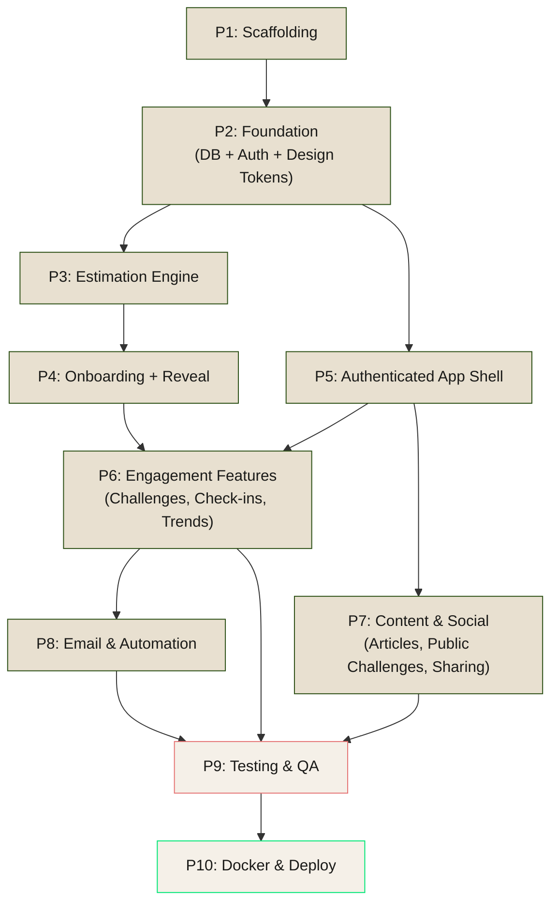

# My FootPrint — Claude-Flow Implementation Plan

**Version:** 1.0
**Date:** March 1, 2026
**Methodology:** SPARC (Specification → Pseudocode → Architecture → Refinement → Completion)
**Orchestrator:** claude-flow (ruflo v3)
**Local Build:** Docker
**Deployment:** Vercel

---

## Table of Contents

1. [Specialist Agents](#specialist-agents)
2. [Phase Overview](#phase-overview)
3. [Dependency Graph](#dependency-graph)
4. [Phase 1: Specification & Scaffolding](#phase-1-specification--scaffolding)
5. [Phase 2: Foundation Layer](#phase-2-foundation-layer)
6. [Phase 3: Core Engine](#phase-3-core-engine)
7. [Phase 4: Onboarding Experience](#phase-4-onboarding-experience)
8. [Phase 5: Authenticated App Shell](#phase-5-authenticated-app-shell)
9. [Phase 6: Engagement Features](#phase-6-engagement-features)
10. [Phase 7: Content & Social](#phase-7-content--social)
11. [Phase 8: Email & Automation](#phase-8-email--automation)
12. [Phase 9: Testing & QA](#phase-9-testing--qa)
13. [Phase 10: Docker & Deployment](#phase-10-docker--deployment)
14. [Swarm Configuration](#swarm-configuration)
15. [Success Criteria](#success-criteria)
16. [Risks & Mitigations](#risks--mitigations)

---

## Specialist Agents

### Agent Definitions

Place these in `.claude/agents/` within the project root.

#### orchestrator.yaml

```yaml
name: orchestrator
type: coordinator
description: "Project coordinator — decomposes tasks, routes to specialists, tracks progress"
capabilities:
  - task_decomposition
  - dependency_analysis
  - resource_allocation
  - progress_tracking
priority: high
temperature: 0.2
systemPrompt: |
  You are the orchestrator for the My FootPrint web application build.
  Reference docs: docs/product/PRD.md, docs/product/ARCHITECTURE.md, docs/product/DESIGN_SYSTEM.md
  Your job is to coordinate specialist agents, verify task completion, and ensure
  the dependency graph is respected. Do NOT implement code yourself — delegate
  to the appropriate specialist agent.
  When a phase completes, verify all artifacts exist before advancing.
```

#### scaffolder.yaml

```yaml
name: scaffolder
type: coder
description: "Project setup — Next.js init, dependency installation, config files, Docker"
capabilities:
  - code-generation
  - configuration
  - devops
focus:
  - next-js
  - tailwind
  - docker
  - vercel
temperature: 0.2
systemPrompt: |
  You scaffold the My FootPrint Next.js 15 App Router project.
  Reference: docs/product/ARCHITECTURE.md (Technology Stack + Project Structure sections)
  You handle: npx create-next-app, package.json dependencies, tsconfig, next.config.ts,
  vercel.json, Dockerfile, docker-compose.yml, .env.example, folder structure creation.
  Use exact package versions from the architecture doc. Follow the project structure exactly.
```

#### database-specialist.yaml

```yaml
name: database-specialist
type: coder
description: "Database schema, Drizzle ORM, Neon PostgreSQL, migrations"
capabilities:
  - schema-design
  - queries
  - migrations
  - orm
focus:
  - drizzle-orm
  - postgresql
  - neon
temperature: 0.2
systemPrompt: |
  You implement the database layer for My FootPrint.
  Reference: docs/product/ARCHITECTURE.md (Data Model section — full Drizzle schema provided)
  You handle: src/lib/db/schema.ts, src/lib/db/index.ts (Neon serverless driver),
  drizzle.config.ts, and running drizzle-kit generate + migrate.
  Copy the schema exactly from the architecture doc. Set up the Neon connection
  with @neondatabase/serverless. For Docker local dev, use a local PostgreSQL container.
```

#### auth-specialist.yaml

```yaml
name: auth-specialist
type: coder
description: "Clerk authentication — middleware, sign-in/up pages, webhook handler"
capabilities:
  - code-generation
  - authentication
  - middleware
focus:
  - clerk
  - next-auth
  - oauth
temperature: 0.2
systemPrompt: |
  You implement Clerk authentication for My FootPrint.
  Reference: docs/product/ARCHITECTURE.md (Auth section + API routes)
  You handle: middleware.ts (Clerk auth gate), sign-in/sign-up catch-all pages,
  Clerk provider in root layout, webhook handler at api/webhooks/clerk/route.ts,
  and the onboarding/complete API route that persists Zustand state to DB on sign-up.
  Public routes: /, /onboarding, /onboarding/reveal, /api/score/calculate,
  /api/articles, /api/public-challenges, /api/benchmarks.
  All other routes require auth.
```

#### engine-developer.yaml

```yaml
name: engine-developer
type: coder
description: "Carbon footprint estimation engine — EPA data, calculation logic, swaps"
capabilities:
  - code-generation
  - data-processing
  - algorithms
focus:
  - emissions-calculation
  - epa-data
  - estimation
temperature: 0.3
systemPrompt: |
  You build the footprint estimation engine for My FootPrint.
  Reference: docs/product/ARCHITECTURE.md (Estimation Engine + Emissions Data sections)
  Reference: docs/product/PRD.md (Features 1-3: Measurement, Analysis, Suggestions)
  You handle: src/lib/estimation/engine.ts, factors.ts, grid.ts, benchmarks.ts, swaps.ts
  and the static JSON data files in src/data/emissions/.
  The engine takes a FootprintProfile and returns: totalTons, earthEquivalents,
  percentileRank, breakdown by category, and topSwap recommendation.
  Use EPA emissions factors, eGRID regional grid intensity data, and US Census
  regional averages for benchmarking. Data sourced from published EPA datasets.
  All calculation happens server-side in route handlers.
```

#### ui-specialist.yaml

```yaml
name: ui-specialist
type: coder
description: "Design system implementation — Tailwind tokens, base components, fonts, illustrations"
capabilities:
  - code-generation
  - css
  - design-systems
focus:
  - tailwind-css
  - design-tokens
  - accessibility
temperature: 0.3
systemPrompt: |
  You implement the My FootPrint design system in code.
  Reference: docs/product/DESIGN_SYSTEM.md (FULL document — tokens, typography, colors, motion, components)
  You handle: src/app/globals.css (@theme directive with all design tokens),
  public/fonts/ (Clash Display, JetBrains Mono, Space Grotesk woff2 files),
  src/components/ui/ (button, card, toggle, progress-bar, tooltip, skeleton),
  src/components/layout/ (bottom-nav, sidebar-nav, watercolor-bg),
  src/components/motion/lazy-motion-provider.tsx.
  Use Tailwind v4 @theme for all tokens. Follow the color palette, typography scale,
  spacing scale, radius, shadows, and motion tokens exactly from the design system doc.
  Every component must implement the snappy micro-interaction patterns defined in the doc.
  WCAG 2.1 AA compliance required. Respect prefers-reduced-motion.
```

#### frontend-developer.yaml

```yaml
name: frontend-developer
type: coder
description: "Page components, features, client interactivity — onboarding, dashboard, reveal"
capabilities:
  - code-generation
  - react
  - animations
focus:
  - next-js-app-router
  - motion
  - embla-carousel
  - recharts
  - zustand
temperature: 0.3
systemPrompt: |
  You build the page-level React components and features for My FootPrint.
  Reference: docs/product/PRD.md (User Journeys + Features)
  Reference: docs/product/ARCHITECTURE.md (Project Structure — full page/component tree)
  Reference: docs/product/DESIGN_SYSTEM.md (Frontend aesthetics prompt — include in your work)
  You handle: all files under src/app/ (pages), src/components/onboarding/,
  src/components/reveal/, src/components/dashboard/, src/components/explore/,
  src/components/charts/, src/components/challenges/, src/components/check-in/,
  src/components/celebrations/, src/components/share/, src/stores/onboarding-store.ts,
  and src/hooks/.
  Use Motion (LazyMotion) for all animations. Use Embla Carousel for swipeable cards.
  Use Recharts for breakdown pie and trend line charts. Use Zustand with persist
  middleware for the anonymous onboarding flow.
  Mobile-first. Max-width 480px centered on desktop.
```

#### api-developer.yaml

```yaml
name: api-developer
type: coder
description: "Next.js route handlers — all API endpoints, Zod validation"
capabilities:
  - code-generation
  - api-design
  - validation
focus:
  - next-js-route-handlers
  - zod
  - rest-api
temperature: 0.2
systemPrompt: |
  You implement all Next.js App Router API route handlers for My FootPrint.
  Reference: docs/product/ARCHITECTURE.md (API Design section — full endpoint specs with request/response)
  You handle: all files under src/app/api/ and src/lib/validations.ts (Zod schemas).
  Every route handler must: validate input with Zod, use Drizzle for DB queries,
  return typed JSON responses matching the architecture doc specs exactly.
  Auth-protected routes must use Clerk's auth() to get the user.
  Use nanoid for generating IDs. Use the estimation engine for score calculations.
  Handle errors consistently: 400 for validation, 401 for unauth, 404 for not found, 500 for server.
```

#### content-developer.yaml

```yaml
name: content-developer
type: coder
description: "MDX knowledge articles, content pipeline, article API"
capabilities:
  - code-generation
  - content-management
focus:
  - mdx
  - next-mdx-remote
  - gray-matter
temperature: 0.4
systemPrompt: |
  You implement the knowledge article system and write the launch articles for My FootPrint.
  Reference: docs/product/PRD.md (Feature 8: Knowledge Articles)
  Reference: docs/product/ARCHITECTURE.md (Content section + article API endpoints)
  You handle: content/articles/*.mdx (5 launch articles), src/lib/articles.ts
  (MDX loading, frontmatter parsing, rendering), article list and detail API routes,
  and the learn pages (src/app/(authenticated)/learn/).
  Each MDX article needs frontmatter: title, slug, category, readTimeMinutes, takeaways, sources.
  Articles must be 2-3 minute reads, plain language, end with actionable takeaways.
  Categories: food, transit, home, shopping, travel, banking.
```

#### email-developer.yaml

```yaml
name: email-developer
type: coder
description: "Resend integration, React Email templates, Vercel Cron weekly trigger"
capabilities:
  - code-generation
  - email
focus:
  - resend
  - react-email
  - vercel-cron
temperature: 0.2
systemPrompt: |
  You implement the email and cron system for My FootPrint.
  Reference: docs/product/ARCHITECTURE.md (Email section + Cron route)
  Reference: docs/product/PRD.md (Weekly Engagement Flow + Edge Cases for re-engagement)
  You handle: src/lib/email/send.ts (Resend client), src/lib/email/templates/
  (weekly-check-in.tsx, re-engagement.tsx as React Email components),
  src/app/api/cron/weekly-emails/route.ts, and vercel.json cron config.
  The cron runs daily at 9am UTC, queries users whose notification_day matches
  the current day, and sends check-in reminder emails via Resend.
  Protect the cron route with CRON_SECRET header verification.
  Email templates must use the My FootPrint design language (warm sand, deep forest,
  electric green accent).
```

#### tester.yaml

```yaml
name: tester
type: tester
description: "Unit tests, integration tests, accessibility audits, performance checks"
capabilities:
  - unit-testing
  - integration-testing
  - coverage
  - accessibility
focus:
  - vitest
  - testing-library
  - playwright
  - axe
temperature: 0.2
systemPrompt: |
  You write tests for My FootPrint.
  Reference: docs/product/PRD.md (Performance Requirements)
  Reference: docs/product/ARCHITECTURE.md (full API specs for integration tests)
  You handle: test setup (vitest config, testing-library), unit tests for the estimation
  engine (src/lib/estimation/engine.test.ts), API route integration tests,
  component tests for critical UI flows (onboarding, reveal, check-in),
  and accessibility audits (axe-core).
  Target: estimation engine 100% coverage, API routes 80%+ coverage, critical UI flows tested.
  Performance: verify LCP < 2s, TTI < 3s on simulated mid-range device.
```

#### reviewer.yaml

```yaml
name: reviewer
type: reviewer
description: "Code review, quality analysis, security review, best practices"
capabilities:
  - code-review
  - quality-analysis
  - best-practices
  - security
focus:
  - owasp
  - accessibility
  - performance
temperature: 0.2
systemPrompt: |
  You review all code produced by other agents for My FootPrint.
  Check for: OWASP top 10 vulnerabilities (XSS, injection, CSRF), accessibility
  (WCAG 2.1 AA), performance anti-patterns (unnecessary client-side JS, missing
  lazy loading, unoptimized images), TypeScript type safety, proper error handling,
  Clerk auth enforcement on protected routes, and adherence to the design system.
  Flag issues by severity: critical (blocks deploy), warning (should fix), info (suggestion).
  Do NOT rewrite code — report findings to the orchestrator for the responsible agent to fix.
```

#### devops.yaml

```yaml
name: devops
type: coder
description: "Docker setup, Vercel deployment config, CI pipeline, environment management"
capabilities:
  - code-generation
  - devops
  - docker
  - ci-cd
focus:
  - docker
  - vercel
  - github-actions
temperature: 0.2
systemPrompt: |
  You handle Docker local development and Vercel deployment for My FootPrint.
  You handle: Dockerfile (multi-stage: deps → build → runner), docker-compose.yml
  (Next.js app + local PostgreSQL for dev), .dockerignore, vercel.json (cron config,
  headers, rewrites), .env.example, and any CI config needed.
  Docker local build must: run the full Next.js app with a local Postgres DB,
  seed the database with schema, and be startable with a single `docker compose up`.
  For Vercel: configure the cron schedule, environment variables list, and build settings.
  The app must build and run identically in Docker and on Vercel (Neon in prod, local PG in Docker).
```

---

## Phase Overview

```mermaid
gantt
    title My FootPrint Implementation Phases
    dateFormat X
    axisFormat %s

    section Foundation
    P1 Scaffolding           :p1, 0, 1
    P2 Foundation Layer      :p2, after p1, 2

    section Core
    P3 Estimation Engine     :p3, after p2, 2
    P4 Onboarding Experience :p4, after p3, 2

    section App
    P5 Auth App Shell        :p5, after p2, 2
    P6 Engagement Features   :p6, after p4 p5, 3

    section Content & Polish
    P7 Content & Social      :p7, after p5, 2
    P8 Email & Automation    :p8, after p6, 1

    section Ship
    P9 Testing & QA          :p9, after p6 p7 p8, 2
    P10 Docker & Deploy      :p10, after p9, 1
```



---

## Dependency Graph



### Parallelization Opportunities

| Can Run in Parallel | Reason |
|---|---|
| P3 (Engine) + P5 (App Shell) | Both depend on P2, independent of each other |
| P5 (App Shell) + P7 (Content) | P7 only needs the authenticated layout from P5, not engagement features |
| P6 tasks internally | Challenge system, check-in system, and trend charts are independent components |

---

## Phase 1: Specification & Scaffolding

**Agent:** `scaffolder`
**Dependencies:** None (first phase)
**Strategy:** Sequential

### Tasks

```yaml
- id: task-1.1
  description: "Initialize Next.js 15 App Router project with TypeScript"
  agent: scaffolder
  priority: high
  dependencies: []
  artifacts:
    - package.json
    - tsconfig.json
    - next.config.ts
  details: |
    npx create-next-app@latest myfootprint --typescript --tailwind --eslint
    --app --src-dir --import-alias "@/*"
    Ensure: App Router (not Pages), src/ directory enabled, Tailwind v4.

- id: task-1.2
  description: "Install all project dependencies from architecture doc"
  agent: scaffolder
  priority: high
  dependencies: [task-1.1]
  artifacts:
    - package.json (updated)
    - package-lock.json
  details: |
    Core: next@15, react@19, typescript@5
    Styling: tailwindcss@4, @tailwindcss/typography, clsx, tailwind-merge
    DB: drizzle-orm, drizzle-kit, @neondatabase/serverless
    Auth: @clerk/nextjs
    Animation: motion, embla-carousel-react
    Charts: recharts
    State: zustand
    Content: next-mdx-remote, gray-matter
    Email: resend, @react-email/components
    Image: @vercel/og
    Util: zod, nanoid, date-fns
    Dev: vitest, @testing-library/react, @testing-library/jest-dom,
         prettier, prettier-plugin-tailwindcss, eslint-config-next

- id: task-1.3
  description: "Create full folder structure from architecture doc"
  agent: scaffolder
  priority: high
  dependencies: [task-1.1]
  artifacts:
    - All directories listed in ARCHITECTURE.md Project Structure
  details: |
    Create all directories:
    src/app/(authenticated)/, src/app/api/*, src/components/*,
    src/lib/db/, src/lib/estimation/, src/lib/email/templates/,
    src/stores/, src/hooks/, src/data/emissions/, src/types/,
    content/articles/, public/fonts/, public/illustrations/, emails/
    Add placeholder .gitkeep where needed.

- id: task-1.4
  description: "Create configuration files"
  agent: scaffolder
  priority: high
  dependencies: [task-1.2]
  artifacts:
    - vercel.json
    - drizzle.config.ts
    - .env.example
    - .gitignore
    - prettier.config.js
  details: |
    vercel.json: cron schedule (0 9 * * * for /api/cron/weekly-emails)
    drizzle.config.ts: point to src/lib/db/schema.ts, dialect postgresql,
      dbCredentials from DATABASE_URL env var
    .env.example: all env vars from architecture doc (no values)
    .gitignore: node_modules, .next, .env.local, .drizzle
    prettier: tailwind plugin enabled

- id: task-1.5
  description: "Create Dockerfile and docker-compose.yml for local development"
  agent: devops
  priority: high
  dependencies: [task-1.2]
  artifacts:
    - Dockerfile
    - docker-compose.yml
    - .dockerignore
  details: |
    Dockerfile: multi-stage build (deps → build → runner)
      Stage 1 (deps): FROM node:20-alpine, COPY package*.json, RUN npm ci
      Stage 2 (build): COPY src, RUN npm run build
      Stage 3 (runner): FROM node:20-alpine, COPY --from=build, EXPOSE 3000
    docker-compose.yml:
      services:
        app:
          build: .
          ports: 3000:3000
          environment: DATABASE_URL=postgresql://postgres:postgres@db:5432/myfootprint
          depends_on: db
          volumes: ./src:/app/src (for dev hot reload)
        db:
          image: postgres:16-alpine
          environment: POSTGRES_DB=myfootprint, POSTGRES_USER=postgres, POSTGRES_PASSWORD=postgres
          ports: 5432:5432
          volumes: pgdata:/var/lib/postgresql/data
      volumes:
        pgdata:
    .dockerignore: node_modules, .next, .git, docs
```

### Phase 1 Verification

```bash
# Orchestrator verifies:
docker compose build        # Builds without errors
docker compose up -d db     # Postgres starts
npm run dev                 # Next.js dev server starts at localhost:3000
npm run build               # Production build succeeds
```

---

## Phase 2: Foundation Layer

**Agents:** `database-specialist`, `auth-specialist`, `ui-specialist` (parallel where possible)
**Dependencies:** Phase 1 complete
**Strategy:** Parallel (3 independent tracks)

### Track A: Database (database-specialist)

```yaml
- id: task-2.1
  description: "Implement Drizzle schema from architecture doc"
  agent: database-specialist
  priority: high
  dependencies: [task-1.4]
  artifacts:
    - src/lib/db/schema.ts
  details: |
    Copy the full Drizzle schema from ARCHITECTURE.md Data Model section.
    All 8 tables: users, footprint_profiles, footprint_scores, challenges,
    check_ins, public_challenges, public_challenge_participants, partners.
    All relations defined. JSONB columns typed with $type<>().

- id: task-2.2
  description: "Set up Drizzle client with Neon serverless driver"
  agent: database-specialist
  priority: high
  dependencies: [task-2.1]
  artifacts:
    - src/lib/db/index.ts
  details: |
    Import neon from @neondatabase/serverless.
    Create drizzle instance with neon(process.env.DATABASE_URL).
    Export db client and all schema tables.
    For local Docker dev: detect DATABASE_URL pointing to local PG and
    use standard pg driver instead of Neon serverless.

- id: task-2.3
  description: "Generate and run initial migration"
  agent: database-specialist
  priority: high
  dependencies: [task-2.2]
  artifacts:
    - src/lib/db/migrations/
  details: |
    Run: npx drizzle-kit generate
    Run: npx drizzle-kit migrate
    Verify all 8 tables created in local Docker Postgres.
    Add npm scripts: "db:generate", "db:migrate", "db:studio" to package.json.
```

### Track B: Authentication (auth-specialist)

```yaml
- id: task-2.4
  description: "Set up Clerk provider and middleware"
  agent: auth-specialist
  priority: high
  dependencies: [task-1.4]
  artifacts:
    - src/app/layout.tsx (updated with ClerkProvider)
    - middleware.ts
  details: |
    Root layout: wrap app in <ClerkProvider>.
    middleware.ts: use clerkMiddleware() with publicRoutes config.
    Public routes: /, /onboarding(.*), /sign-in(.*), /sign-up(.*),
    /api/score/calculate, /api/articles(.*), /api/public-challenges,
    /api/benchmarks(.*).
    All other routes protected.

- id: task-2.5
  description: "Create Clerk sign-in and sign-up pages"
  agent: auth-specialist
  priority: high
  dependencies: [task-2.4]
  artifacts:
    - src/app/sign-in/[[...sign-in]]/page.tsx
    - src/app/sign-up/[[...sign-up]]/page.tsx
  details: |
    Use Clerk's <SignIn /> and <SignUp /> components.
    Style to match design system (warm sand background, deep forest text).
    Center on page with max-width 480px.

- id: task-2.6
  description: "Implement Clerk webhook handler for user sync"
  agent: auth-specialist
  priority: high
  dependencies: [task-2.1, task-2.4]
  artifacts:
    - src/app/api/webhooks/clerk/route.ts
  details: |
    Handle 'user.created' and 'user.deleted' webhook events.
    On user.created: insert into users table with clerkId and email.
    On user.deleted: delete user and cascade (all related data removed).
    Verify webhook signature using Clerk's svix headers.
```

### Track C: Design System (ui-specialist)

```yaml
- id: task-2.7
  description: "Implement Tailwind v4 design tokens in globals.css"
  agent: ui-specialist
  priority: high
  dependencies: [task-1.2]
  artifacts:
    - src/app/globals.css
  details: |
    Use @theme directive to define all tokens from DESIGN_SYSTEM.md:
    Colors (base, surface, primary, secondary, accent, text, muted, negative, celebrate,
    accent-glow, shadow, border, overlay, category colors).
    Typography (font-display, font-mono, font-body + full scale).
    Spacing (xs through 4xl). Radius (sm through full). Shadows (sm, md, lg, glow).
    Motion (ease-snap, ease-smooth, duration-snap, duration-smooth, duration-count, stagger-delay).

- id: task-2.8
  description: "Add web fonts to public/fonts/ and configure in layout"
  agent: ui-specialist
  priority: high
  dependencies: [task-2.7]
  artifacts:
    - public/fonts/ClashDisplay-Variable.woff2
    - public/fonts/JetBrainsMono-Variable.woff2
    - public/fonts/SpaceGrotesk-Variable.woff2
    - src/app/layout.tsx (font-face declarations)
  details: |
    Download variable font woff2 files for Clash Display, JetBrains Mono, Space Grotesk.
    Add @font-face declarations in globals.css or use next/font/local.
    Map to CSS variables: --font-display, --font-mono, --font-body.

- id: task-2.9
  description: "Build base UI component library"
  agent: ui-specialist
  priority: high
  dependencies: [task-2.7]
  artifacts:
    - src/components/ui/button.tsx
    - src/components/ui/card.tsx
    - src/components/ui/toggle.tsx
    - src/components/ui/progress-bar.tsx
    - src/components/ui/tooltip.tsx
    - src/components/ui/skeleton.tsx
    - src/components/motion/lazy-motion-provider.tsx
  details: |
    Every component must use design tokens from globals.css.
    Button: electric green bg, deep forest text, scale(0.96) on press with spring-back ease.
    Card: surface bg, shadow-sm resting, shadow-md on hover, 16px radius.
    Toggle: snap with spring physics, overshoot then settle.
    Progress-bar: electric green fill on surface track.
    All transitions respect prefers-reduced-motion.
    LazyMotion provider: load domAnimation features async.

- id: task-2.10
  description: "Build layout components (nav, watercolor backgrounds)"
  agent: ui-specialist
  priority: high
  dependencies: [task-2.9]
  artifacts:
    - src/components/layout/bottom-nav.tsx
    - src/components/layout/sidebar-nav.tsx
    - src/components/layout/watercolor-bg.tsx
  details: |
    Bottom nav (mobile): 5 tabs — Home, Explore, Challenges, Learn, Profile.
    Icons + labels, active state in electric green, fixed to bottom.
    Sidebar nav (desktop ≥768px): same 5 items, vertical, left-side.
    Watercolor background: accepts category prop, renders the appropriate
    SVG illustration at 8-15% opacity, positioned bottom-right, bleed off edge.
    Use placeholder SVGs initially (colored gradient blobs).
```

### Phase 2 Verification

```bash
# Orchestrator verifies:
docker compose up            # App + DB start
npx drizzle-kit studio       # Schema visible in Drizzle Studio
# Visit localhost:3000 — landing page renders with correct fonts and colors
# Visit localhost:3000/sign-in — Clerk sign-in page renders
# Tailwind tokens resolve correctly (inspect CSS variables in devtools)
```

---

## Phase 3: Core Engine

**Agent:** `engine-developer`
**Dependencies:** Phase 2 Track A (database)
**Strategy:** Sequential

```yaml
- id: task-3.1
  description: "Create EPA emissions factor data files"
  agent: engine-developer
  priority: high
  dependencies: [task-2.1]
  artifacts:
    - src/data/emissions/factors.json
    - src/data/emissions/grid-regions.json
    - src/data/emissions/grid-intensity.json
    - src/data/emissions/benchmarks.json
    - src/data/emissions/swaps.json
  details: |
    factors.json: base annual emissions by category and input choice.
      Structure: { food: { meat_heavy: 3.3, flexitarian: 2.5, vegetarian: 1.7, vegan: 1.5 },
      transit: { car: 4.6, mix: 2.8, transit: 1.2, bike: 0.1, walk: 0.0 }, ... }
    grid-regions.json: mapping of US zip code prefixes (3-digit) to eGRID subregions.
    grid-intensity.json: eGRID subregion → lbs CO2 per MWh (from EPA eGRID data).
    benchmarks.json: percentile distributions by region { "national": { p10: 8, p25: 11, p50: 16, p75: 21, p90: 27 } }
    swaps.json: catalog of alternatives per category with impact deltas and difficulty ratings.
    Source all numbers from EPA published data. Document sources in comments.

- id: task-3.2
  description: "Implement core estimation engine"
  agent: engine-developer
  priority: high
  dependencies: [task-3.1]
  artifacts:
    - src/lib/estimation/engine.ts
    - src/lib/estimation/factors.ts
    - src/lib/estimation/grid.ts
    - src/lib/estimation/benchmarks.ts
    - src/lib/estimation/swaps.ts
  details: |
    engine.ts: main calculateFootprint(profile) function.
      Input: { zipCode?, dietType, transitMode, homeType, shoppingFrequency, flightsPerYear, customOverrides? }
      Output: { totalTons, earthEquivalents, percentileRank, breakdown, topSwap }
      Logic: sum category emissions from factors, adjust home energy by grid region,
      apply custom overrides, calculate earth equivalents (total / 1.73 global avg),
      calculate percentile rank against benchmarks, find highest-impact easiest swap.
    factors.ts: load and query factors.json
    grid.ts: zip → eGRID region → carbon intensity lookup
    benchmarks.ts: percentile calculation given totalTons and region
    swaps.ts: filter and rank available swaps for a given profile

- id: task-3.3
  description: "Implement score calculation API route"
  agent: api-developer
  priority: high
  dependencies: [task-3.2]
  artifacts:
    - src/app/api/score/calculate/route.ts
    - src/lib/validations.ts (partial — onboarding schema)
  details: |
    POST /api/score/calculate — public route (no auth required).
    Validate request body with Zod (OnboardingInputSchema).
    Call calculateFootprint() from engine.
    Return the full score response matching ARCHITECTURE.md spec.
    This route is called BEFORE account creation (anonymous user).
```

### Phase 3 Verification

```bash
# Orchestrator verifies:
curl -X POST localhost:3000/api/score/calculate \
  -H "Content-Type: application/json" \
  -d '{"dietType":"flexitarian","transitMode":"car","homeType":"apartment","shoppingFrequency":"moderate","flightsPerYear":"one_to_two"}'
# Returns valid score JSON with totalTons, breakdown, percentileRank, topSwap
```

---

## Phase 4: Onboarding Experience

**Agent:** `frontend-developer`
**Dependencies:** Phase 3 (engine), Phase 2 Track C (UI components)
**Strategy:** Sequential

```yaml
- id: task-4.1
  description: "Implement Zustand onboarding store with localStorage persistence"
  agent: frontend-developer
  priority: high
  dependencies: [task-2.9]
  artifacts:
    - src/stores/onboarding-store.ts
  details: |
    Zustand store with persist middleware (localStorage).
    State: { answers: { zipCode, dietType, transitMode, homeType, shoppingFrequency, flightsPerYear },
    currentStep: number, score: ScoreResult | null, committedSwap: Swap | null, characterType: string | null }
    Actions: setAnswer(key, value), setStep(n), setScore(result), commitSwap(swap),
    setCharacter(type), reset()
    Persist key: "myfootprint-onboarding"

- id: task-4.2
  description: "Build landing page"
  agent: frontend-developer
  priority: high
  dependencies: [task-2.9, task-2.10]
  artifacts:
    - src/app/page.tsx
  details: |
    Clean hero: "Discover your footprint in 90 seconds."
    One CTA button (electric green) linking to /onboarding.
    No sign-up required. Mobile-first, centered, max-width 480px.
    Apply frontend_aesthetics prompt from DESIGN_SYSTEM.md.

- id: task-4.3
  description: "Build 6-question onboarding questionnaire with Embla Carousel"
  agent: frontend-developer
  priority: high
  dependencies: [task-4.1, task-4.2]
  artifacts:
    - src/app/onboarding/page.tsx
    - src/components/onboarding/question-carousel.tsx
    - src/components/onboarding/question-card.tsx
    - src/components/onboarding/footprint-preview.tsx
    - src/components/onboarding/progress-dots.tsx
  details: |
    Embla Carousel: full-screen swipeable cards, one question per card.
    6 questions matching PRD spec (zip, transit, diet, home, shopping, flights).
    Large icon selectors for each option (not radio buttons).
    Footprint preview: animating visual that grows/shrinks with each answer.
    Progress dots at top (not a bar).
    Each answer saves to Zustand store.
    On final question answered: POST to /api/score/calculate, save result
    to Zustand, navigate to /onboarding/reveal.
    Partial save: if user leaves and returns, resume from last answered question.

- id: task-4.4
  description: "Build 6-card Wrapped-style reveal experience"
  agent: frontend-developer
  priority: high
  dependencies: [task-4.3]
  artifacts:
    - src/app/onboarding/reveal/page.tsx
    - src/components/reveal/reveal-carousel.tsx
    - src/components/reveal/score-card.tsx
    - src/components/reveal/world-card.tsx
    - src/components/reveal/breakdown-card.tsx
    - src/components/reveal/rank-card.tsx
    - src/components/reveal/potential-card.tsx
    - src/components/reveal/character-card.tsx
    - src/components/reveal/count-up.tsx
  details: |
    Full-screen Embla Carousel, no navigation chrome.
    6 cards matching PRD spec exactly:
    1. Score: headline number with count-up animation (Motion useMotionValue)
    2. World: Earth equivalents visual
    3. Breakdown: animated pie chart (Recharts PieChart with animation)
    4. Rank: percentile in region
    5. Potential: savings gap with electric green accent
    6. Character: avatar reveal (user picks or auto-assigned)
    Each card: staggered entrance animations (Motion AnimatePresence).
    Final card CTA: "See your first quick win" → shows topSwap from score.
    "Commit" button saves swap to Zustand store.
    After commit: prompt sign-up → Clerk sign-up → POST /api/onboarding/complete.

- id: task-4.5
  description: "Implement onboarding completion API route"
  agent: api-developer
  priority: high
  dependencies: [task-2.6, task-3.2]
  artifacts:
    - src/app/api/onboarding/complete/route.ts
  details: |
    POST /api/onboarding/complete — auth required (Clerk session).
    Receives full Zustand state: profile answers, score, character, first challenge.
    Creates: FootprintProfile, FootprintScore (source: "initial"), Challenge (if committed),
    updates User (onboardingComplete: true, characterType, zipCode, region).
    All in a single transaction.
    Returns: { userId, onboardingComplete: true }
```

### Phase 4 Verification

```bash
# Orchestrator verifies:
# Visit localhost:3000 — landing page renders
# Click CTA → swipe through 6 questions → each saves to localStorage
# After Q6 → API call → reveal cards render with real score data
# Count-up animations work, pie chart draws in
# Commit to swap → sign up → data persisted to DB
# Refresh → dashboard loads (not onboarding again)
```

---

## Phase 5: Authenticated App Shell

**Agents:** `frontend-developer`, `api-developer` (parallel tracks)
**Dependencies:** Phase 2 (auth + DB + UI components)
**Strategy:** Parallel where possible

```yaml
- id: task-5.1
  description: "Build authenticated layout with navigation"
  agent: frontend-developer
  priority: high
  dependencies: [task-2.4, task-2.10]
  artifacts:
    - src/app/(authenticated)/layout.tsx
  details: |
    Clerk auth check — redirect to /sign-in if not authenticated.
    Redirect to /onboarding if onboardingComplete is false.
    Render bottom-nav (mobile) or sidebar-nav (desktop).
    Content area with warm sand background.

- id: task-5.2
  description: "Build dashboard page"
  agent: frontend-developer
  priority: high
  dependencies: [task-5.1, task-2.9]
  artifacts:
    - src/app/(authenticated)/dashboard/page.tsx
    - src/components/dashboard/score-hero.tsx
    - src/components/dashboard/challenge-row.tsx
    - src/components/dashboard/check-in-prompt.tsx
    - src/components/dashboard/category-grid.tsx
    - src/components/dashboard/article-teaser.tsx
  details: |
    Score hero: big score in JetBrains Mono, character visual, trend arrow.
    Challenge row: horizontal scrollable cards of active challenges.
    Check-in prompt: prominent CTA when weekly check-in is due, dismissible after.
    Category grid: 6 tappable category cards with watercolor backgrounds.
    Article teaser: latest knowledge article preview at bottom.
    All data fetched server-side (RSC) from DB.

- id: task-5.3
  description: "Build explore page with category detail and swap toggles"
  agent: frontend-developer
  priority: high
  dependencies: [task-5.1, task-3.2]
  artifacts:
    - src/app/(authenticated)/explore/page.tsx
    - src/app/(authenticated)/explore/[category]/page.tsx
    - src/components/explore/category-detail.tsx
    - src/components/explore/swap-toggle.tsx
    - src/components/explore/partner-badge.tsx
  details: |
    Explore overview: all 6 categories with current tons and percentage.
    Category detail: sub-category breakdown, multiple "What if?" toggles.
    Swap toggle: flipping a switch shows real-time impact on score (call estimation engine).
    Multiple toggles can be active simultaneously — show cumulative impact.
    "Commit" button creates a Challenge via POST /api/challenges.
    Partner badge: "Paid partnership" label, shown when a partner exists for a swap.

- id: task-5.4
  description: "Build profile/settings page"
  agent: frontend-developer
  priority: high
  dependencies: [task-5.1]
  artifacts:
    - src/app/(authenticated)/profile/page.tsx
  details: |
    Display: email, display name, character visual.
    Settings: notification day selector (mon-sun), refine profile inputs.
    Account: sign out (Clerk), delete account (with confirmation).
    Profile changes trigger score recalculation via PUT /api/profile.

- id: task-5.5
  description: "Implement profile and score history API routes"
  agent: api-developer
  priority: high
  dependencies: [task-2.1, task-2.4]
  artifacts:
    - src/app/api/profile/route.ts
    - src/app/api/score/history/route.ts
  details: |
    GET /api/profile: return user + footprint profile.
    PUT /api/profile: update profile, recalculate score, save new FootprintScore.
    GET /api/score/history: return score array ordered by calculatedAt desc, with limit param.
    Include cumulativeSaved and projectedAnnual calculations.
```

### Phase 5 Verification

```bash
# Orchestrator verifies:
# Authenticated user lands on /dashboard with real data
# Navigation works (all 5 tabs)
# Explore → category detail → swap toggles update score in real-time
# Profile → change notification day → saved
# Score history API returns data for trend display
```

---

## Phase 6: Engagement Features

**Agents:** `frontend-developer`, `api-developer`
**Dependencies:** Phase 4 + Phase 5
**Strategy:** Parallel (3 independent feature tracks)

### Track A: Challenge System

```yaml
- id: task-6.1
  description: "Implement challenges API routes"
  agent: api-developer
  priority: high
  dependencies: [task-2.1, task-2.4]
  artifacts:
    - src/app/api/challenges/route.ts
    - src/app/api/challenges/[id]/route.ts
    - src/app/api/swaps/route.ts
  details: |
    GET /api/challenges: list user's challenges, filterable by status.
    Include weekly progress from check-ins for each challenge.
    POST /api/challenges: create challenge from swap commitment.
    PUT /api/challenges/[id]: update status (completed, abandoned).
    GET /api/swaps: available swaps by category, personalized to user profile.

- id: task-6.2
  description: "Build challenges page"
  agent: frontend-developer
  priority: high
  dependencies: [task-6.1, task-5.1]
  artifacts:
    - src/app/(authenticated)/challenges/page.tsx
    - src/components/challenges/challenge-card.tsx
  details: |
    List active challenges with progress indicators.
    Each card shows: title, category, impact_tons, weekly progress (thumbs history).
    Mark complete/abandon actions.
    Link to explore page to find new challenges.
```

### Track B: Check-In System

```yaml
- id: task-6.3
  description: "Implement check-in API route"
  agent: api-developer
  priority: high
  dependencies: [task-2.1, task-3.2]
  artifacts:
    - src/app/api/check-ins/route.ts
  details: |
    GET /api/check-ins: list past check-ins for the user.
    POST /api/check-ins: submit weekly check-in.
    On submission: save CheckIn record, recalculate score based on challenge progress,
    save new FootprintScore (source: "check_in"), update user.lastCheckIn.
    Return: checkIn, updatedScore, milestone (if any triggered).
    Milestone triggers: first_check_in, first_ton_saved, streak_4_weeks, streak_12_weeks.

- id: task-6.4
  description: "Build check-in flow page"
  agent: frontend-developer
  priority: high
  dependencies: [task-6.3, task-5.1]
  artifacts:
    - src/app/(authenticated)/check-in/page.tsx
    - src/components/check-in/check-in-flow.tsx
    - src/components/check-in/thumbs-input.tsx
  details: |
    Multi-step flow: one screen per active challenge.
    Thumbs up/down per challenge (large tap targets).
    Optional: additional notes text input.
    Submit → score updates → celebration if milestone hit.
    Redirect to dashboard after completion.

- id: task-6.5
  description: "Build milestone celebration overlay"
  agent: frontend-developer
  priority: high
  dependencies: [task-6.4]
  artifacts:
    - src/components/celebrations/milestone-overlay.tsx
    - src/components/celebrations/confetti.tsx
  details: |
    Full-screen animated overlay triggered by milestones.
    Character reacts (grows, glows).
    Confetti/particle effects — brief (2-3 seconds), delightful.
    Share button to generate FootPrint Card.
    Dismiss to return to dashboard.
    Use Motion AnimatePresence for enter/exit.
```

### Track C: Trends

```yaml
- id: task-6.6
  description: "Build trends page with charts"
  agent: frontend-developer
  priority: high
  dependencies: [task-5.5, task-5.1]
  artifacts:
    - src/app/(authenticated)/trends/page.tsx
    - src/components/charts/breakdown-pie.tsx
    - src/components/charts/trend-line.tsx
  details: |
    Trend line: Recharts LineChart showing totalTons over time.
    Breakdown pie: Recharts PieChart with category colors.
    Stats: projected annual footprint, cumulative savings.
    Message if < 4 weeks of data: "Check in weekly to unlock your trends."
    Use design system colors for chart elements.
```

### Phase 6 Verification

```bash
# Orchestrator verifies:
# Create challenge from explore page → appears on challenges page
# Submit weekly check-in → score recalculates → trend updates
# Hit a milestone → celebration overlay triggers with confetti
# Trends page shows line chart after 2+ check-ins
```

---

## Phase 7: Content & Social

**Agents:** `content-developer`, `frontend-developer`, `api-developer`
**Dependencies:** Phase 5 (authenticated shell)
**Strategy:** Parallel (2 independent tracks)

### Track A: Knowledge Articles

```yaml
- id: task-7.1
  description: "Write 5 launch MDX articles"
  agent: content-developer
  priority: high
  dependencies: []
  artifacts:
    - content/articles/meat-and-climate.mdx
    - content/articles/your-bank-and-fossil-fuels.mdx
    - content/articles/hidden-carbon-cost-of-fast-fashion.mdx
    - content/articles/the-flight-dilemma.mdx
    - content/articles/home-energy-quick-wins.mdx
  details: |
    Each article: 2-3 minute read, plain language, no jargon.
    Frontmatter: title, slug, category, readTimeMinutes, takeaways (array), sources (array of {title, url}).
    One article per category: food, banking, shopping, travel, home.
    End with 1-2 actionable takeaways. Cite sources.
    Tone: empowering, not guilt-inducing.

- id: task-7.2
  description: "Implement article loading library and API routes"
  agent: content-developer
  priority: high
  dependencies: [task-7.1]
  artifacts:
    - src/lib/articles.ts
    - src/app/api/articles/route.ts
    - src/app/api/articles/[slug]/route.ts
  details: |
    src/lib/articles.ts: read MDX files from content/articles/, parse frontmatter
    with gray-matter, render with next-mdx-remote. Functions: getAllArticles(),
    getArticleBySlug(slug), getArticlesByCategory(category).
    API routes: GET /api/articles (list, filterable by ?category=), GET /api/articles/[slug].

- id: task-7.3
  description: "Build learn pages"
  agent: frontend-developer
  priority: high
  dependencies: [task-7.2, task-5.1]
  artifacts:
    - src/app/(authenticated)/learn/page.tsx
    - src/app/(authenticated)/learn/[slug]/page.tsx
  details: |
    List page: article cards with title, category tag, read time. Category filter tabs.
    Detail page: rendered MDX with Tailwind typography styles.
    Takeaways highlighted at bottom. Sources as links.
    Watercolor background matching article category.
```

### Track B: Public Challenges & Sharing

```yaml
- id: task-7.4
  description: "Implement public challenges API routes"
  agent: api-developer
  priority: high
  dependencies: [task-2.1, task-2.4]
  artifacts:
    - src/app/api/public-challenges/route.ts
    - src/app/api/public-challenges/[id]/join/route.ts
    - src/app/api/public-challenges/[id]/leave/route.ts
  details: |
    GET /api/public-challenges: list active challenges (public, no auth).
    POST /api/public-challenges/[id]/join: auth required, create participant record,
    increment participantCount.
    POST /api/public-challenges/[id]/leave: auth required, update status to "left",
    decrement participantCount.

- id: task-7.5
  description: "Add public challenges UI to challenges page"
  agent: frontend-developer
  priority: high
  dependencies: [task-7.4, task-6.2]
  artifacts:
    - src/components/challenges/public-challenge-card.tsx
    - src/app/(authenticated)/challenges/page.tsx (updated)
  details: |
    Add "Public Challenges" section below personal challenges.
    Card: title, description, participant count, date range, join/leave button.
    Participation visible, scores are NOT visible.

- id: task-7.6
  description: "Implement share card generation"
  agent: api-developer
  priority: high
  dependencies: [task-2.1]
  artifacts:
    - src/app/api/share/card/route.ts
    - src/app/api/og/[cardId]/route.ts
  details: |
    POST /api/share/card: auth required. Generate a card ID, store card data.
    Return imageUrl pointing to /api/og/[cardId].
    GET /api/og/[cardId]: Edge function using @vercel/og ImageResponse.
    Render JSX card with: My FootPrint branding, score (if opted in),
    milestone text, character visual. Use design system colors.
    Load Clash Display and JetBrains Mono fonts for the card.

- id: task-7.7
  description: "Build share button and preview components"
  agent: frontend-developer
  priority: high
  dependencies: [task-7.6]
  artifacts:
    - src/components/share/share-button.tsx
    - src/components/share/footprint-card-preview.tsx
  details: |
    Share button: uses Web Share API where available (navigator.share),
    falls back to copy-link-to-clipboard.
    Preview: shows a rendered preview of the share card before sharing.
    Integrated into: reveal cards, milestone overlay, challenges page.
```

### Phase 7 Verification

```bash
# Orchestrator verifies:
# Visit /learn — 5 articles listed with category filters
# Click article — full MDX renders with typography styles
# Visit /challenges — public challenges section visible
# Join a public challenge → participant count increments
# Share button → generates OG image → preview renders
```

---

## Phase 8: Email & Automation

**Agent:** `email-developer`
**Dependencies:** Phase 6 (check-in system exists)
**Strategy:** Sequential

```yaml
- id: task-8.1
  description: "Set up Resend client and React Email templates"
  agent: email-developer
  priority: high
  dependencies: [task-2.7]
  artifacts:
    - src/lib/email/send.ts
    - src/lib/email/templates/weekly-check-in.tsx
    - src/lib/email/templates/re-engagement.tsx
  details: |
    send.ts: Resend client wrapper. Function: sendEmail(to, subject, template, props).
    weekly-check-in.tsx: React Email template.
      Subject: "Your weekly FootPrint check-in is ready"
      Content: character visual, current score, "How did your [challenge] go?" CTA
      button linking to /check-in. Design: warm sand bg, deep forest text, electric green CTA.
    re-engagement.tsx: sent after 2 missed check-ins.
      Subject: "Your FootPrint character misses you"
      Content: character looking sad, "Quick 30-second update?" CTA.

- id: task-8.2
  description: "Implement weekly email cron route"
  agent: email-developer
  priority: high
  dependencies: [task-8.1, task-6.3]
  artifacts:
    - src/app/api/cron/weekly-emails/route.ts
    - vercel.json (updated with cron)
  details: |
    POST /api/cron/weekly-emails:
    Verify CRON_SECRET header (Vercel sends this automatically).
    Query users where notification_day matches current day of week.
    For each user: check lastCheckIn date.
      If ≤ 7 days ago: skip (already checked in this week).
      If 7-21 days ago: send weekly-check-in email.
      If > 21 days ago: send re-engagement email.
      If > 90 days ago: skip (dormant, don't spam).
    Log: sent count, skipped count, error count.
    Return summary JSON.
```

### Phase 8 Verification

```bash
# Orchestrator verifies:
# Manually POST to /api/cron/weekly-emails with CRON_SECRET header
# Verify email sent via Resend dashboard (or use Resend test mode)
# Email renders correctly with design system styles
```

---

## Phase 9: Testing & QA

**Agents:** `tester`, `reviewer`
**Dependencies:** Phases 6, 7, 8 (all features built)
**Strategy:** Parallel (tester + reviewer work simultaneously)

### Testing Track (tester)

```yaml
- id: task-9.1
  description: "Set up test infrastructure"
  agent: tester
  priority: high
  dependencies: [task-1.2]
  artifacts:
    - vitest.config.ts
    - src/test/setup.ts
  details: |
    Configure vitest with: jsdom environment, @testing-library/react,
    path aliases matching tsconfig, coverage reporter.
    Setup file: configure testing-library, mock Clerk auth, mock Neon DB.

- id: task-9.2
  description: "Write estimation engine unit tests"
  agent: tester
  priority: critical
  dependencies: [task-9.1, task-3.2]
  artifacts:
    - src/lib/estimation/engine.test.ts
  details: |
    Test calculateFootprint() with all input combinations.
    Verify: totalTons is reasonable (4-30 range), breakdown sums to total,
    earthEquivalents = total / 1.73, percentileRank is 0-100,
    topSwap is returned and has valid impact.
    Edge cases: missing zipCode (fallback to national), extreme inputs.
    Target: 100% coverage of engine.ts.

- id: task-9.3
  description: "Write API route integration tests"
  agent: tester
  priority: high
  dependencies: [task-9.1, task-6.3]
  artifacts:
    - src/app/api/**/*.test.ts
  details: |
    Test all API routes with mocked DB and auth.
    Key flows: POST /api/score/calculate, POST /api/onboarding/complete,
    POST /api/check-ins (verify score recalculation), PUT /api/challenges/[id].
    Verify: correct status codes, Zod validation rejects bad input,
    auth-required routes return 401 without session.
    Target: 80%+ coverage of route handlers.

- id: task-9.4
  description: "Write critical UI component tests"
  agent: tester
  priority: high
  dependencies: [task-9.1, task-4.4]
  artifacts:
    - src/components/onboarding/question-carousel.test.tsx
    - src/components/reveal/reveal-carousel.test.tsx
    - src/components/check-in/check-in-flow.test.tsx
  details: |
    Test onboarding carousel: all 6 questions render, answers save to store,
    navigation works (swipe/tap).
    Test reveal: 6 cards render with score data, count-up triggers, CTA works.
    Test check-in flow: challenges render, thumbs input works, submission calls API.
    Use @testing-library/react with user-event for interaction simulation.

- id: task-9.5
  description: "Run accessibility audit"
  agent: tester
  priority: high
  dependencies: [task-9.4]
  artifacts:
    - docs/product/ACCESSIBILITY_REPORT.md
  details: |
    Run axe-core on all pages: landing, onboarding, reveal, dashboard,
    explore, challenges, check-in, learn, profile.
    Verify: all interactive elements keyboard-navigable, color contrast ratios
    meet WCAG 2.1 AA (especially electric green on sand/surface backgrounds),
    screen reader labels on all icons and charts, aria attributes on carousels.
    Document findings with severity levels.
```

### Review Track (reviewer)

```yaml
- id: task-9.6
  description: "Security review of all API routes and auth flow"
  agent: reviewer
  priority: critical
  dependencies: [task-6.3, task-7.6]
  artifacts:
    - Review report stored in memory namespace "review"
  details: |
    Review all route handlers for:
    - Clerk auth enforcement on protected routes
    - Zod input validation (no unvalidated user input reaching DB)
    - SQL injection protection (Drizzle parameterizes, but verify)
    - CSRF protection on mutations
    - Webhook signature verification (Clerk webhook)
    - CRON_SECRET verification on cron route
    - No secrets in client-side code
    - Rate limiting considerations
    Flag: critical (blocks deploy), warning (should fix), info (suggestion).

- id: task-9.7
  description: "Code quality and architecture review"
  agent: reviewer
  priority: high
  dependencies: [task-9.6]
  artifacts:
    - Review report stored in memory namespace "review"
  details: |
    Review entire codebase for:
    - TypeScript strict mode compliance (no any, proper typing)
    - Design system adherence (correct tokens, no hardcoded colors)
    - Component modularity (no god components)
    - Server vs client component boundaries (minimize "use client")
    - Bundle size concerns (lazy loading charts, carousel, Motion features)
    - Error handling consistency
    - No console.logs in production code
```

### Phase 9 Verification

```bash
# Orchestrator verifies:
npm run test                    # All tests pass
npm run test -- --coverage      # Coverage meets targets
# Accessibility report has no critical findings
# Security review has no critical findings
# All review warnings addressed by responsible agents
```

---

## Phase 10: Docker & Deployment

**Agent:** `devops`
**Dependencies:** Phase 9 (all tests pass, reviews addressed)
**Strategy:** Sequential

```yaml
- id: task-10.1
  description: "Finalize Docker build for local development"
  agent: devops
  priority: high
  dependencies: [task-9.5, task-9.7]
  artifacts:
    - Dockerfile (finalized)
    - docker-compose.yml (finalized)
    - scripts/docker-seed.sh
  details: |
    Ensure Dockerfile produces a working production build.
    docker-compose.yml: app + postgres, with DB seed script.
    scripts/docker-seed.sh: run drizzle-kit migrate, seed public challenges
    and partner data into local DB.
    Add npm scripts: "docker:build", "docker:up", "docker:seed".
    Verify: `docker compose up` starts the full app from scratch.

- id: task-10.2
  description: "Verify complete Docker local build"
  agent: devops
  priority: critical
  dependencies: [task-10.1]
  artifacts:
    - Verification log
  details: |
    Clean build from scratch:
    docker compose down -v && docker compose build --no-cache && docker compose up -d
    Run: docker compose exec app npm run db:migrate
    Run: docker compose exec app npm run db:seed (if seed script exists)
    Verify: localhost:3000 loads, full onboarding flow works end-to-end,
    check-in flow works, articles render, all API routes respond.
    Test on: Chrome, Safari, Firefox.

- id: task-10.3
  description: "Configure Vercel deployment"
  agent: devops
  priority: high
  dependencies: [task-10.2]
  artifacts:
    - vercel.json (finalized)
    - docs/product/DEPLOYMENT.md
  details: |
    vercel.json: cron config, framework detection (nextjs), build command,
    output directory, headers (security headers, CORS).
    DEPLOYMENT.md: step-by-step deployment guide:
    1. Create Vercel project, link repo
    2. Add Neon Postgres via Vercel Marketplace (auto-sets DATABASE_URL)
    3. Set environment variables: CLERK_*, RESEND_API_KEY, CRON_SECRET, NEXT_PUBLIC_APP_URL
    4. Configure Clerk webhook URL to point to production domain
    5. Deploy
    6. Run drizzle-kit migrate against Neon
    7. Seed public challenges and partners
    8. Verify cron job runs on schedule
```

### Phase 10 Verification

```bash
# Orchestrator verifies:
docker compose down -v
docker compose up --build      # Clean build succeeds
# Full E2E flow works in Docker:
#   Landing → Onboarding → Reveal → Sign Up → Dashboard → Check-in → Trends
# Vercel deployment guide is complete and accurate
```

---

## Swarm Configuration

### Initialize the Swarm

```bash
# Initialize claude-flow with hierarchical topology
npx ruflo init --wizard

# Start swarm with development strategy
npx ruflo swarm init \
  --topology hierarchical \
  --max-agents 8 \
  --strategy development \
  --auto-spawn \
  --memory

# Register MCP server with Claude Code
claude mcp add ruflo -- npx ruflo@latest mcp start
```

### Agent Spawn Order

Spawn agents in dependency order. Not all agents are needed simultaneously.

```bash
# Phase 1-2: Foundation (spawn 4 agents)
npx ruflo agent spawn -t coordinator -n "orchestrator" --task "Coordinate My FootPrint build"
npx ruflo agent spawn -t coder -n "scaffolder" --task "Scaffold Next.js project"
npx ruflo agent spawn -t coder -n "database-specialist" --task "Implement Drizzle schema"
npx ruflo agent spawn -t coder -n "ui-specialist" --task "Implement design system"

# Phase 2: Add auth specialist
npx ruflo agent spawn -t coder -n "auth-specialist" --task "Implement Clerk auth"

# Phase 3-4: Swap scaffolder for engine and frontend devs
npx ruflo agent stop scaffolder
npx ruflo agent spawn -t coder -n "engine-developer" --task "Build estimation engine"
npx ruflo agent spawn -t coder -n "frontend-developer" --task "Build onboarding + reveal"

# Phase 5-7: Add API and content devs
npx ruflo agent spawn -t coder -n "api-developer" --task "Implement API routes"
npx ruflo agent spawn -t coder -n "content-developer" --task "Write articles + content pipeline"

# Phase 8: Swap for email dev
npx ruflo agent spawn -t coder -n "email-developer" --task "Implement email + cron"

# Phase 9-10: Testing + review + devops
npx ruflo agent spawn -t tester -n "tester" --task "Write tests and run audits"
npx ruflo agent spawn -t reviewer -n "reviewer" --task "Security and quality review"
npx ruflo agent spawn -t coder -n "devops" --task "Docker + Vercel deployment"
```

### Memory Namespaces

```bash
# Agents share artifacts through these namespaces:
# "arch"    — architecture decisions and schema
# "impl"    — implementation details and code paths
# "test"    — test results and coverage reports
# "review"  — review findings and action items
# "deploy"  — deployment config and verification logs
```

---

## Success Criteria

| Criteria | Metric | Phase |
|---|---|---|
| Project builds | `npm run build` exits 0 | P1 |
| Docker runs | `docker compose up` → app at localhost:3000 | P10 |
| Estimation engine accurate | Unit tests pass, scores in 4-30 ton range | P3 |
| Onboarding < 90 seconds | 6 questions completable in time | P4 |
| Reveal renders | All 6 cards with animations | P4 |
| Anonymous → authenticated | Zustand state persists through sign-up | P4 |
| Dashboard loads | All sections render with real data | P5 |
| Score recalculates on check-in | New FootprintScore created | P6 |
| Milestone celebrations trigger | Overlay renders with confetti | P6 |
| Articles render | 5 MDX articles with typography | P7 |
| Share cards generate | OG image renders at edge | P7 |
| Emails send | Resend delivers check-in reminder | P8 |
| Tests pass | `npm run test` exits 0 | P9 |
| Engine coverage | 100% | P9 |
| API coverage | ≥ 80% | P9 |
| No critical security findings | Reviewer sign-off | P9 |
| No critical accessibility findings | axe-core audit clean | P9 |
| LCP < 2 seconds | Lighthouse on simulated mid-range device | P9 |
| Vercel deploys | Production build + all env vars configured | P10 |

---

## Risks & Mitigations

| Risk | Probability | Impact | Mitigation |
|---|---|---|---|
| EPA data accuracy/availability | Medium | High | Use well-documented averages, clearly label as estimates, allow manual refinement |
| Clerk free tier limits (10K MAU) | Low (prototype) | Medium | Monitor usage, Auth.js is a drop-in alternative if needed |
| Neon cold starts in serverless | Medium | Medium | Use connection pooling, warm critical paths, acceptable for weekly-use app |
| Watercolor illustrations not available | High | Low | Use CSS gradient blobs as placeholders, commission illustrations separately |
| Tailwind v4 breaking changes | Low | Medium | Pin version, consult migration guide for any issues |
| Docker local PG vs Neon prod differences | Low | Medium | Use standard PostgreSQL features only, test migrations in both environments |
| Recharts bundle size on mobile | Medium | Low | Lazy-load chart components, only import on routes that need them |
| MDX rendering performance | Low | Low | Articles are static content, rendered at build time or cached |

---

*This implementation plan maps directly to the architecture defined in `docs/product/ARCHITECTURE.md`. Every task references specific files and sections from the architecture doc. Agents should consult the architecture doc, PRD, and design system as their primary references.*
